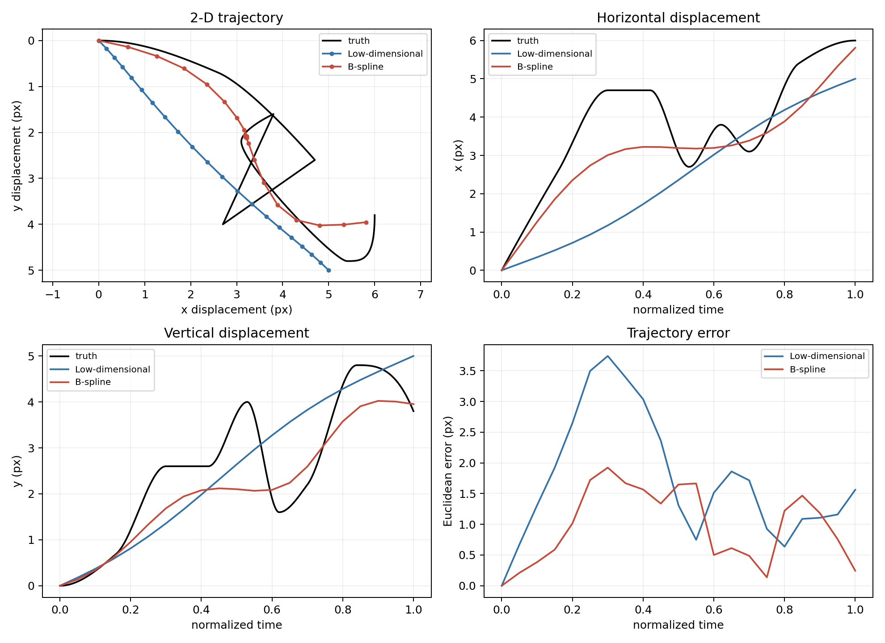
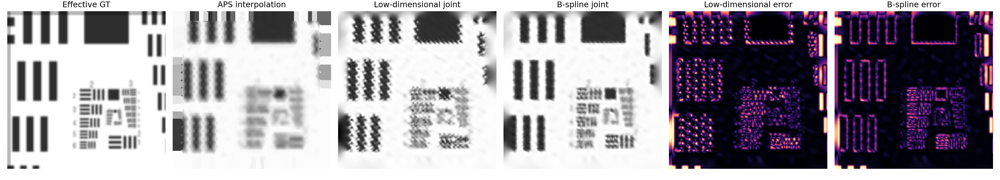
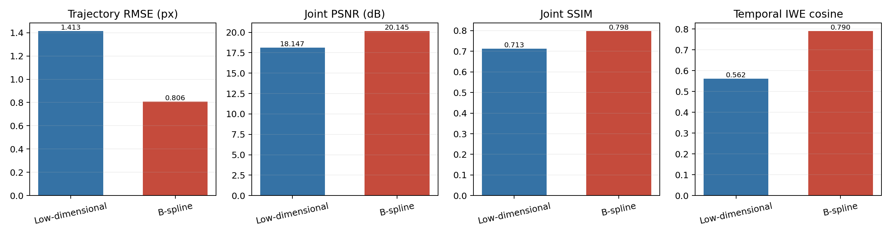
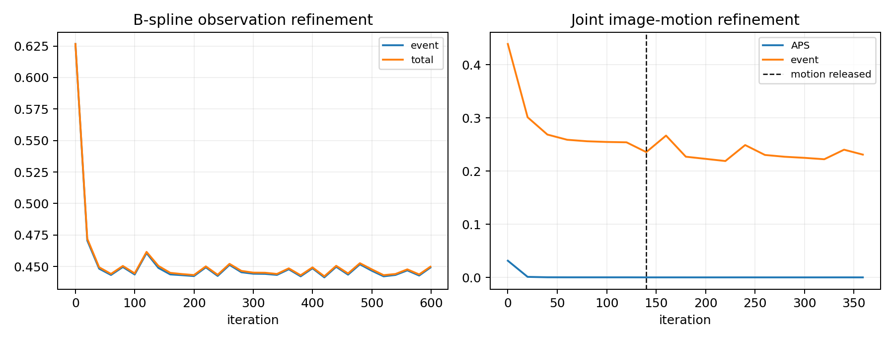
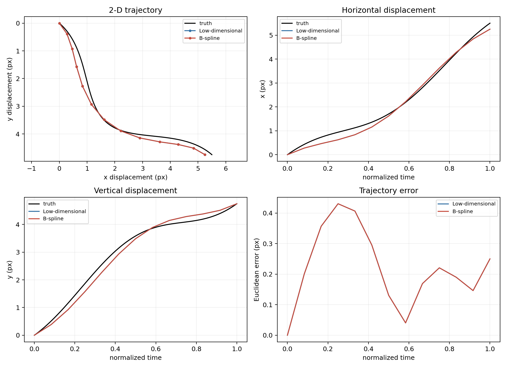
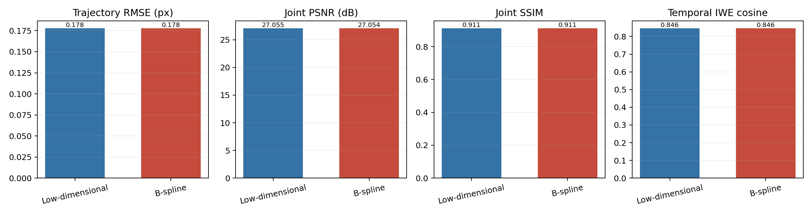

# B-spline 盲运动对比实验

## 1. 方法

新增的轨迹模型是 clamped cubic B-spline：

$$
\mathbf u(t)=\sum_{j=1}^{J}B_j(t)\mathbf c_j.
$$

它仍然只读取 `core_mask + APS + events`，不读取真值轨迹。完整流程为：

1. 用原低维模型得到稳定初始化；
2. 优化少量 B-spline 控制点，使 APS 预测与 temporal IWE 更一致；
3. event loss 相对改善至少 `8%` 才接受样条，否则自动保留低维轨迹；
4. 接受后先固定运动预热图像，再联合微调图像和样条控制点；
5. 固定最终轨迹，使用完全相同的重建器公平比较。

GT 只在两个模型全部重建结束后加载，用于绘图和评价。核心代码位于：

- `src/fibre_iwe/trajectory.py`：B-spline 基函数与拟合；
- `src/fibre_iwe/motion.py`：候选估计、观测门槛和联合微调；
- `src/fibre_iwe/comparison.py`：同数据比较与可视化；
- `run_motion_comparison.py`：命令行入口。

## 2. 复杂轨迹

复杂轨迹由 PCHIP 关键帧生成，不是用 B-spline 生成，包含停顿、反向和快速二维转向。这样可以避免“生成模型等于估计模型”的不公平优势。

| 指标 | 低维模型 | B-spline | 改善 |
| --- | ---: | ---: | ---: |
| 轨迹 RMSE | `1.413 px` | **`0.806 px`** | **`0.607 px`** |
| endpoint error | `1.562 px` | **`0.245 px`** | **`1.317 px`** |
| temporal IWE cosine | `0.562` | **`0.790`** | **`+0.228`** |
| Joint PSNR | `18.147 dB` | **`20.145 dB`** | **`+1.998 dB`** |
| Joint SSIM | `0.7129` | **`0.7976`** | **`+0.0846`** |

B-spline 候选使观测 event loss 改善约 `29.9%`，因此被自动接受。它恢复了停顿平台、终点和部分回折，重建中的重影与锯齿明显减少。









## 3. 平滑轨迹控制实验

原二维平滑轨迹本来就符合低维模型。B-spline 候选只使 event loss 改善 `2.8%`，低于门槛，因此自动回退：

| 指标 | 低维模型 | 自适应 B-spline |
| --- | ---: | ---: |
| 轨迹 RMSE | `0.178 px` | `0.178 px` |
| Joint PSNR | `27.055 dB` | `27.054 dB` |
| Joint SSIM | `0.9110` | `0.9111` |

千分位差异来自 GPU 数值波动。该实验说明额外自由度只在观测明确支持时启用，不会默认破坏简单运动结果。





## 4. 运行方法

复杂轨迹完整对比：

```bash
cd /home/robbie/tyf_code/EventCode/myFEFibreSR/fibre_iwe_reconstruction
/home/robbie/miniconda3/envs/NeuroFibreSR/bin/python run_motion_comparison.py \
  --config configs/complex_motion.yaml
```

对已有观测或真实数据比较：

```bash
/home/robbie/miniconda3/envs/NeuroFibreSR/bin/python run_motion_comparison.py \
  --config configs/complex_motion.yaml \
  --reuse-observations \
  --data-root /path/to/recording
```

真实数据仍只需 `observations/core_mask.npz` 和 `observations/recording.h5`。没有 GT 时不计算轨迹误差和 PSNR，改看模型是否被观测门槛接受、APS 重投影和 temporal IWE 一致性。

## 5. 当前边界

B-spline 明显优于低维模型，但没有完全恢复复杂轨迹中幅度最大的反向段；`0.806 px` 仍高于同参数化 oracle 的约 `0.28 px`。剩余瓶颈是单帧 APS、事件阈值未知和一阶 event forward 的运动/图像歧义，而不是 B-spline 表达能力。真实实验中 `8%` 门槛应通过重复采集验证，不应使用 GT 调节。
