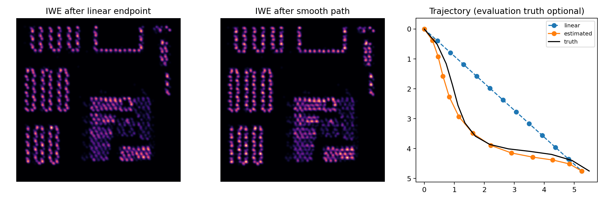
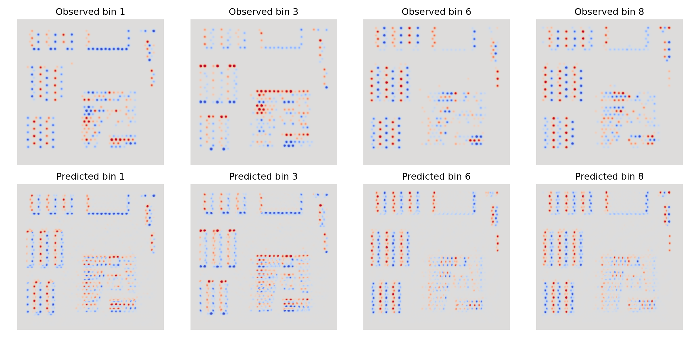

# Core-IWE 一维/二维光纤盲重建实验报告

## 1. 实验目的

验证仅使用一张 core mask、原始 APS 和原始 events，能否在不知道真值运动、事件阈值、PSF、pixel gain 和 GT 的条件下：

1. 盲估计一维或二维平滑微扫描轨迹；
2. 分别完成 event-only 图像反演、APS-only 和 APS + core-IWE 重建；
3. 恢复连续、无蜂窝的有效图像，并能直接替换真实观测。

## 2. 反演输入审计

| 反演可读取 | 内容 |
| --- | --- |
| `observations/core_mask.npz` | 只有 pixel-to-core `labels` |
| `observations/recording.h5` | 原始 APS、`[t,x,y,p]` events、曝光时间 |

`private_truth/` 中的物体、运动、事件阈值、PSF、芯信号和近端响应只在全部反演结束后用于评价。实际测试还使用了一个完全没有 `private_truth/` 的独立目录，仍能生成全部重建和诊断结果。

## 3. 两种仿真场景

| 场景 | 真值 endpoint | 曲率 | 原始 events | 目的 |
| --- | ---: | ---: | ---: | --- |
| 一维水平 | `[5.5, 0.0] px` | `0` | 5152 | 与原基线对照，验证单方向超分 |
| 二维弯曲 | `[5.5, 4.75] px` | `1.6 px` | 7058 | 同时激发 x/y 梯度并改变速度方向 |

二维轨迹不是简单斜直线。生成器使用：

$$
\mathbf{u}(t)
= e(t)\mathbf{d}
+ \kappa\sin^2(\pi t)\mathbf{n},
$$

其中 $\mathbf{d}$ 为二维 endpoint，$\mathbf{n}$ 为其法向，$e(t)$ 为轻微非匀速时间函数。仿真轨迹只负责生成数据，反演不读取这些参数。

生成事件时，远端图像先成为每芯标量强度 $c_i(t)$，再按 log-intensity 阈值跨越产生 `(core_id,t,p)`。近端 event `(x,y)` 按不规则芯斑响应随机分配，只用于判断 `core_id`，不作为远端亚芯空间信息。

## 4. 盲运动估计

仅用普通 IWE 方差会偏好固定六角芯格，二维 endpoint 还可能落入晶格方向别名。当前使用三个简单步骤：

1. density-normalized CMax 给出 endpoint 候选；
2. 用粗 APS 预测候选轨迹下的 temporal IWE，与观测 events 比较，消除二维晶格别名；
3. endpoint 固定后，只搜索法向曲率 $\kappa$ 和沿主方向的非匀速量 $a$：

$$
\mathbf{u}(t)
=t\mathbf{d}
+\kappa\sin^2(\pi t)\mathbf{n}
+a\sin(2\pi t)\widehat{\mathbf{d}}.
$$

这只有两个内部轨迹自由度，比逐个优化 11 个内部控制点更稳定。两种观测 endpoint 相距小于 `1 px` 时用 CMax 做精定位；明显冲突时使用 APS/event consistency 避开晶格别名。整个过程不使用真值轨迹。

最终运动误差：

| 场景 | 估计 endpoint | Endpoint error | Control RMSE |
| --- | ---: | ---: | ---: |
| 一维水平 | `[5.25, 0.0] px` | `0.25 px` | `0.1270 px` |
| 二维弯曲 | `[5.25, 4.75] px` | `0.25 px` | `0.1777 px` |

## 5. 分时段二维 event 前向

旧版只使用总位移 $\Delta\mathbf{u}$，会丢失弯曲轨迹中随时间变化的方向。当前把曝光分成时间段 $b$，将所有 core centres 沿该段轨迹 warp 到参考时刻，同时累计二维位移 flow：

$$
\mathbf{F}_b(\mathbf{x})
=\sum_{i,t\in b}
\Delta\mathbf{u}(t)\,
K\!\left(\mathbf{x}-\mathbf{x}_{i,t}^{\mathrm{warp}}\right).
$$

候选有效图像 $O$ 的预测为：

$$
I_{b,\mathrm{pred}}^{\mathrm{IWE}}(\mathbf{x})
=-\nabla\log O(\mathbf{x})\cdot\mathbf{F}_b(\mathbf{x}).
$$

每段预测和观测 IWE 使用能量加权 cosine loss，所以不需要已知事件阈值。二维场景使用 8 段，保留方向变化；一维场景使用 1 段，避免把单方向阈值残差放大。

APS 分支沿估计轨迹对候选图像做曝光时间平均，再在 core centres 采样，与观测芯强度计算 Huber loss。联合优化采用 `96 x 96 -> 192 x 192` 两级网格和二阶平滑正则。

## 6. Event-only 的物理含义

event-only 的图像优化只使用 temporal core-IWE，图像 loss 不读取 APS；不过它复用前一步由 APS/events 共同估计的盲运动，因此这里的“event-only”是指图像反演约束，并不表示整条运动加图像流程完全不用 APS。events 能约束 log-image 梯度，却不能确定绝对 log-intensity offset 和全局对比度，因此使用固定 mean/std gauge。

所以 event-only 的 correlation 和结构最有解释力，原始 PSNR 会被不可辨识的亮度尺度显著拉低。二维运动提供多个梯度方向，因此 event-only correlation 从一维的 `0.8461` 提升到 `0.9010`，水平积分条纹也明显减少。APS 的主要作用正是补回低频、绝对亮度和稳定对比度。

## 7. 最终定量结果

一维水平扫描：

| 方法 | PSNR | SSIM | Correlation | RMSE |
| --- | ---: | ---: | ---: | ---: |
| APS interpolation | 19.7289 dB | 0.76633 | 0.94255 | 0.10317 |
| Event-only | 10.0207 dB | 0.60804 | 0.84610 | 0.31548 |
| APS-only | 21.1163 dB | 0.79678 | 0.95416 | 0.08794 |
| APS + core-IWE | **23.6518 dB** | **0.87467** | **0.97558** | **0.06568** |

二维弯曲扫描：

| 方法 | PSNR | SSIM | Correlation | RMSE |
| --- | ---: | ---: | ---: | ---: |
| APS interpolation | 19.5624 dB | 0.74830 | 0.94327 | 0.10517 |
| Event-only | 10.5980 dB | 0.72493 | 0.90099 | 0.29519 |
| APS-only | 21.6518 dB | 0.79124 | 0.96043 | 0.08268 |
| APS + core-IWE | **27.0523 dB** | **0.91091** | **0.98934** | **0.04440** |

二维联合重建相对 APS-only 提升 `5.40 dB` PSNR 和 `0.120` SSIM；相对旧的一维实现 `23.1101 dB / 0.86451`，新版一维也提升到 `23.6518 dB / 0.87467`。

二维数据一致性指标为：APS reprojection RMSE `0.000265`，aggregate IWE cosine `0.96630`，temporal IWE cosine `0.84565`。






## 8. 真实数据替换与边界

真实数据只需提供相同的两个观测文件，然后运行：

```bash
/home/robbie/miniconda3/envs/NeuroFibreSR/bin/python run_pipeline.py \
  --config configs/two_dimensional.yaml \
  --reuse-observations \
  --data-root /path/to/real_recording
```

当前两参数轨迹适合平滑机械微扫描。真实轨迹明显更复杂时，应增加少量平滑基函数，而不是恢复逐事件自由运动。真实数据出现稳定系统残差后，再依次考虑全局 APS/event delay、逐芯 gain/threshold 或更复杂的 `h_eff`；第一版不默认增加这些不可辨识参数。

本实验仍未完整模拟逐芯串扰、模式随时间变化、强非线性响应、背景漂移和 refractory effects。二维结果证明了方法在受控物理仿真中的可行性，不应直接替代真实分辨率靶、重复采集和跨参数稳健性实验。
