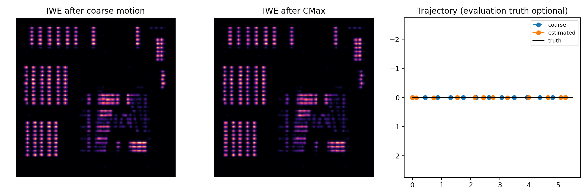
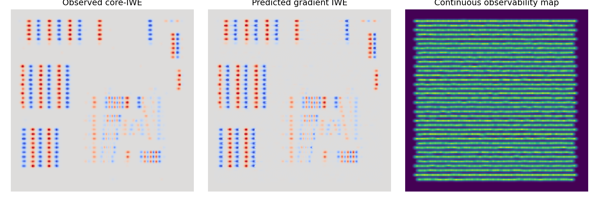

# Core-IWE 光纤仿真与盲重建实验报告

## 1. 实验目的

本实验验证一条最小但完整的光纤重建链路：近端相机只提供一帧 APS、原始 events 和一次 core-mask 标定；算法不知道仿真运动、事件阈值、光学模糊和 GT，仍能先估计远端相对运动，再恢复连续、无蜂窝的有效图像。

当前基线是**水平方向的一维微扫描超分辨实验**。它证明 core-IWE 思路可以工作，但不等同于已经覆盖任意二维运动和全部真实噪声。

## 2. 反演输入审计

重建阶段只读取：

| 文件 | 可观测内容 | 用途 |
| --- | --- | --- |
| `observations/core_mask.npz` | pixel-to-core labels | 确定芯归属、芯中心和 APS 芯强度 |
| `observations/recording.h5` | 原始 APS、`[t, x, y, p]` events、曝光时间 | 运动估计和图像重建 |

以下内容放在 `private_truth/`，只在反演完成后用于作图和评价：

- 有效图像 GT；
- 真实运动轨迹；
- 仿真中的事件阈值、光学模糊、近端响应图和芯信号。

代码边界位于 `src/fibre_iwe/pipeline.py`：先调用 `load_core_observations()`、`estimate_motion()` 和 `reconstruct()`，之后才尝试读取可选的 `private_truth`。因此评价真值没有泄漏到反演过程；真实数据完全没有该目录也能运行。

## 3. 仿真是否接近真实光纤

仿真先把远端连续图像经过共享有效模糊，再在运动过程中采样为每根芯的标量强度。每芯根据 log 强度阈值跨越产生 `(core_id, timestamp, polarity)`；传感器上的 `(x,y)` 则按该芯不规则、非均匀的固定亮斑随机分配。该近端响应图只用于生成并保存在 `private_truth`，反演不知道它。

这比“把 event 的近端 pixel 坐标当成远端亚纤芯位置”更符合当前物理假设：芯内坐标只表示近端模式和传感器响应，不携带可直接反投影的远端空间坐标。

它仍是受控模型，暂未完整模拟逐芯串扰、模式随时间变化、强烈非线性响应、背景漂移和事件相机 refractory effects。这些应通过真实数据残差决定是否加入，而不是一开始全部引入。

## 4. 运动估计为什么需要 density-normalized CMax

所有事件先通过 core mask 归属到纤芯，再放到对应 core centre。候选轨迹把事件 warp 到同一参考时刻，通过 IWE 聚焦程度评价轨迹。

直接最大化普通 IWE 方差会失败：即使运动设为零，事件也已经落在清晰、规则的六角芯阵列上，算法会把“芯格本身很尖锐”误认为“运动补偿正确”。基线中该错误会得到接近零的位移，联合重建约为 `12.7 dB`。

当前实现同时 warp 一张采样密度图，并以局部可观测密度归一化 IWE，再计算 density-weighted contrast。这样优化目标主要衡量同一物体边缘能否对齐，而不是芯阵列在哪里。粗搜索还加入很弱的位移先验，用于压制六角周期造成的别名解。

最终流程为：endpoint 网格搜索、`0.25 px` 局部细化、固定 endpoint 的 12 段低维 CMax 优化。运动完全由观测事件得到。

## 5. 图像重建前向模型

待恢复量是连续的**有效图像**，未知的 GRIN、芯孔径和离焦模糊先吸收到该图像中。

APS 分支使用估计轨迹对候选图像做曝光时间平均，再在 core centres 采样，与标定后的观测芯强度计算误差。

event 分支使用一阶亮度变化关系：

$$
I_{\mathrm{pred}}^{\mathrm{IWE}}(\mathbf{x})
=
-\nabla \log O(\mathbf{x})\cdot\Delta\mathbf{u}\;W(\mathbf{x}),
$$

其中 $O$ 是候选有效图像，$\Delta\mathbf{u}$ 是 core-IWE 估计出的总位移，$W$ 是所有 core centres 沿估计轨迹扫过得到的连续 observability map。预测和观测 IWE 都做尺度归一化，因此第一版不需要知道事件阈值或逐 pixel gain。

优化采用 `96 x 96 -> 192 x 192` 两级网格，并联合 APS、一阶 event 约束和二阶平滑正则。输出是连续图像，不保留蜂窝采样结构。

## 6. 基线结果

固定随机种子下，完整运行得到：

- 芯数：`1098`；
- 仿真原始事件：`5152`；mask 映射后的可用事件：`5119`；
- 真实终点位移：`[5.5, 0.0] px`；
- 盲估计终点位移：`[5.25, 0.0] px`；
- endpoint error：`0.25 px`；
- trajectory control RMSE：`0.1684 px`。

| 方法 | PSNR | SSIM | Correlation | RMSE |
| --- | ---: | ---: | ---: | ---: |
| APS interpolation | 19.7289 dB | 0.76633 | 0.94255 | 0.10317 |
| APS-only optimization | 21.0099 dB | 0.79336 | 0.95293 | 0.08902 |
| APS + core-IWE | **23.1101 dB** | **0.86451** | **0.97330** | **0.06990** |

相对 APS-only，联合结果提升约 `2.10 dB` PSNR 和 `0.071` SSIM。APS 重投影 RMSE 为 `0.001185`，观测/预测 IWE cosine 为 `0.97808`。说明在同一 APS 观测和同一图像参数化下，core-IWE 提供了有效的方向性边缘约束。

## 7. 当前简化是否合理

这些简化适合作为第一版真实数据模型：

| 简化 | 当前处理 | 适用边界 |
| --- | --- | --- |
| 运动轨迹 | 由 core-IWE 盲估计 | 事件足够、运动能激发清晰边缘时可行 |
| pixel gain、事件阈值 | 不读取仿真响应；每芯 APS 用中位数提取，IWE 做归一化 | 存在明显芯间系统偏差时再加逐芯权重 |
| `h_eff` | 固定共享模糊，或吸收到有效图像 | 当前恢复的是有效图像，不声称得到去除全部光学模糊的物体 |
| 芯内 event 位置 | 只用于 core 归属 | 不把近端芯斑内部位置解释为远端位置 |
| APS/event delay | 默认零 | 只有观察到稳定错位时才估计一个全局 delay |

原始 `isl_diff_event_clean` 是通用 DAVIS/NeuroSR 模型，没有显式光纤 core mask、逐芯响应或芯内模式，因此也没有处理上述光纤专属项。这并不代表它们永远不重要，只说明第一版应先保留可辨识、可验证的最小参数集。

## 8. 换成真实数据

真实实验只需保持两个观测文件的字段约定：

1. 用 flat-field 图像分割出 `core_mask.npz`，背景 label 为 0，每根芯为独立正整数；文件只保存 `labels`；
2. 将原始 APS、events 和曝光时间写入 `recording.h5`，保证 APS/events 使用同一 sensor 坐标和设备时钟；
3. 运行 `run_pipeline.py --reuse-observations --data-root /path/to/real_recording`，重建不读取任何仿真真值；
4. 检查 core-IWE 聚焦、APS 重投影和结果稳定性。只有诊断显示系统性残差时，才依次增加全局 delay、逐芯 gain/threshold 或更复杂的 `h_eff`。

真实数据没有 GT 时不能报告 PSNR/SSIM，应改用 APS 重投影误差、event/IWE 一致性、重复采集稳定性，以及分辨率靶的可分辨线对作为证据。

本实现已用一个只含上述两个观测文件、完全没有 `private_truth/` 的独立目录做过端到端验证：运动估计、联合重建、五张诊断图和 `run_summary.json` 均能正常生成，摘要中的 `metrics` 为 `null`，不会伪造 GT 评价。
