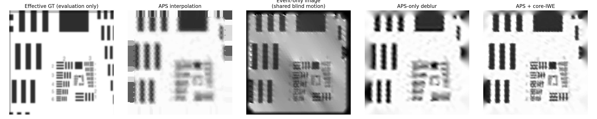

# Core-IWE 光纤仿真与真实数据兼容重建

本目录是一条独立、完整的生成到重建链路：仿真原始光纤 APS/events，只用观测数据盲估计运动，再输出 event-only、APS-only 和 APS + core-IWE 三种连续无蜂窝重建。

## 数据边界

反演只读取：

```text
<data-root>/observations/core_mask.npz
<data-root>/observations/recording.h5
```

- `core_mask.npz` 只包含 pixel-to-core `labels`；
- `recording.h5` 包含一帧原始 APS、原始 `[t, x, y, p]` events 和曝光起止时间。

仿真 GT、真值轨迹、事件阈值、PSF 和近端非均匀响应全部隔离在 `private_truth/`，反演完成后才可选读取用于评价。真实数据完全没有该目录也能运行。

## 核心流程

```text
raw sensor events
  -> core mask 归属
  -> 芯内坐标替换为 core centre
  -> CMax + APS/event 观测一致性估计 endpoint
  -> 两参数平滑二维轨迹
  -> 分时段 observed core-IWE

candidate effective image
  -> 每时段 log-gradient · 2-D trajectory flow
  -> predicted temporal IWE

candidate effective image
  -> 沿估计轨迹做曝光平均
  -> core-centre sampling
  -> predicted core APS
```

event-only 的**图像优化**只使用 events，不把 APS 放入图像 loss；但它与另外两个分支共享前一步由 APS/events 共同盲估计的运动。events 不能确定绝对 log-intensity 的 offset 和 scale，因此该分支使用配置中的固定 mean/std gauge。联合分支用 APS 补回低频和绝对亮度。

## 运行

一维水平基线：

```bash
cd /home/robbie/tyf_code/EventCode/myFEFibreSR/fibre_iwe_reconstruction
/home/robbie/miniconda3/envs/NeuroFibreSR/bin/python run_pipeline.py \
  --config configs/baseline.yaml
```

横纵同时变化的二维弯曲扫描：

```bash
/home/robbie/miniconda3/envs/NeuroFibreSR/bin/python run_pipeline.py \
  --config configs/two_dimensional.yaml
```

真实数据或已有观测：

```bash
/home/robbie/miniconda3/envs/NeuroFibreSR/bin/python run_pipeline.py \
  --config configs/two_dimensional.yaml \
  --reuse-observations \
  --data-root /path/to/real_recording
```

测试：

```bash
/home/robbie/miniconda3/envs/NeuroFibreSR/bin/python -m unittest discover -s tests -v
```

## 最终结果

| 场景 | APS interpolation | Event-only correlation | APS-only | APS + core-IWE |
| --- | ---: | ---: | ---: | ---: |
| 一维水平 | 19.73 dB | 0.8461 | 21.12 dB | **23.65 dB** |
| 二维弯曲 | 19.56 dB | **0.9010** | 21.65 dB | **27.05 dB** |

二维结果的 SSIM 为 `0.91091`，轨迹 control RMSE 为 `0.1777 px`。完整公式、定量表格和结果解释见 [EXPERIMENT_REPORT.md](EXPERIMENT_REPORT.md)。



## 保存结果

每个场景的 `results/` 保存：

- `event_only.npy`、`aps_only.npy`、`joint.npy`；
- 盲运动控制点及 endpoint/path 搜索分数；
- observed/predicted temporal IWE、二维 flow 和 observability；
- 三种 loss history、APS 重投影和 `run_summary.json`；
- 六张生成、运动、重建、IWE、loss 和分时段诊断图。

## 替换真实数据

- flat-field 图像只用于分割 `labels`，背景为 0，每根芯为连续正整数；
- `aps_frame` 转换为 `[0, 1]` 浮点强度；
- events 按 timestamp 排序，polarity 转换为 `-1/+1`；
- APS/events 必须使用同一 sensor 坐标和设备时钟。

真实数据没有 GT 时，摘要中的 `metrics` 为 `null`，评价改用 APS 重投影、temporal IWE cosine、重复采集稳定性和分辨率靶可分辨线对。
