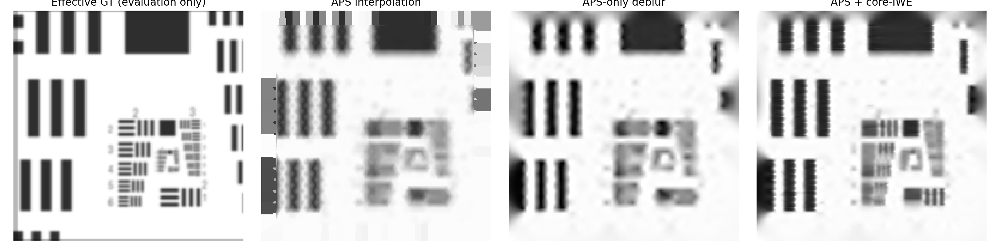

# Core-IWE 光纤仿真与真实数据兼容重建

本目录实现一条独立的完整链路：生成原始光纤 APS/events，自主估计运动，再以 APS + core-IWE 重建连续、无蜂窝的有效图像。

## 最重要的数据边界

重建只允许读取：

```text
outputs/baseline/observations/core_mask.npz
outputs/baseline/observations/recording.h5
```

- `core_mask.npz`：实测时可由一次 flat-field 图像分割得到，只包含 pixel-to-core labels；
- `recording.h5`：一帧原始 APS、原始 events、曝光起止时间。

仿真 GT、真值运动、事件阈值和仿真 PSF 位于 `private_truth/`。它们只在重建结束后评价结果，重建函数没有这些输入。

## 模型

生成事件时，物理信息先被压缩为每芯标量强度 `c_i(t)`。事件的时间与极性来自该标量的 log 强度阈值跨越；event 在近端芯斑内的 `(x,y)` 按不规则固定概率随机分配，不携带远端亚纤芯位置。

重建流程为：

```text
raw events
  -> core mask 归属
  -> 放到 core centre
  -> 12 段低维轨迹 CMax
  -> observed core-IWE

candidate effective image
  -> log gradient · 总位移
  -> 乘连续 observability map
  -> predicted IWE

candidate effective image
  -> 估计轨迹的 APS 时间平均
  -> core centres 采样
  -> predicted core APS
```

这里恢复的是已经吸收 GRIN、芯孔径和离焦影响的**有效图像**。第一版不需要已知 `h_eff`、逐 pixel 事件阈值、真值运动或仿真 gain。

## 运行

```bash
cd /home/robbie/tyf_code/EventCode/myFEFibreSR/fibre_iwe_reconstruction
/home/robbie/miniconda3/envs/NeuroFibreSR/bin/python run_pipeline.py
```

仅使用已有观测重建：

```bash
/home/robbie/miniconda3/envs/NeuroFibreSR/bin/python run_pipeline.py \
  --reuse-observations \
  --data-root /path/to/real_recording
```

`/path/to/real_recording/observations/` 中只需放置 `core_mask.npz` 和 `recording.h5`。没有 `private_truth/` 时仍会保存全部重建结果，并使用 APS 重投影误差与 IWE cosine 一致性代替 GT 指标。

测试：

```bash
/home/robbie/miniconda3/envs/NeuroFibreSR/bin/python -m unittest discover -s tests -v
```

主要结果保存在 `outputs/baseline/results/`：生成观测、运动估计、重建对比、IWE/observability、loss、重投影和 `run_summary.json`。

完整的数据边界、物理假设、定量结果与真实数据替换步骤见 [EXPERIMENT_REPORT.md](EXPERIMENT_REPORT.md)。仓库中保留了一份固定基线的可视化结果：



## 替换真实数据

保持两个文件的字段不变即可，不需要修改重建算法：

- 将真实 flat-field 图像分割为 `labels`，背景为 0、每芯为连续正整数；不保存或使用逐 pixel gain；
- `recording.h5/events_t_s_x_y_p` 使用 `[timestamp_s, sensor_x, sensor_y, polarity]`；
- `aps_frame` 预先转换为 `[0, 1]` 浮点强度，events 按 timestamp 排序且 polarity 为 `-1/+1`；
- APS 与 events 使用同一 sensor shape 和设备时间基准。

如果真实数据暴露明显的全局 APS/event 时间错位，再增加一个全局 delay；不默认引入逐 pixel 阈值、逐芯 PSF 或 transmission matrix。
