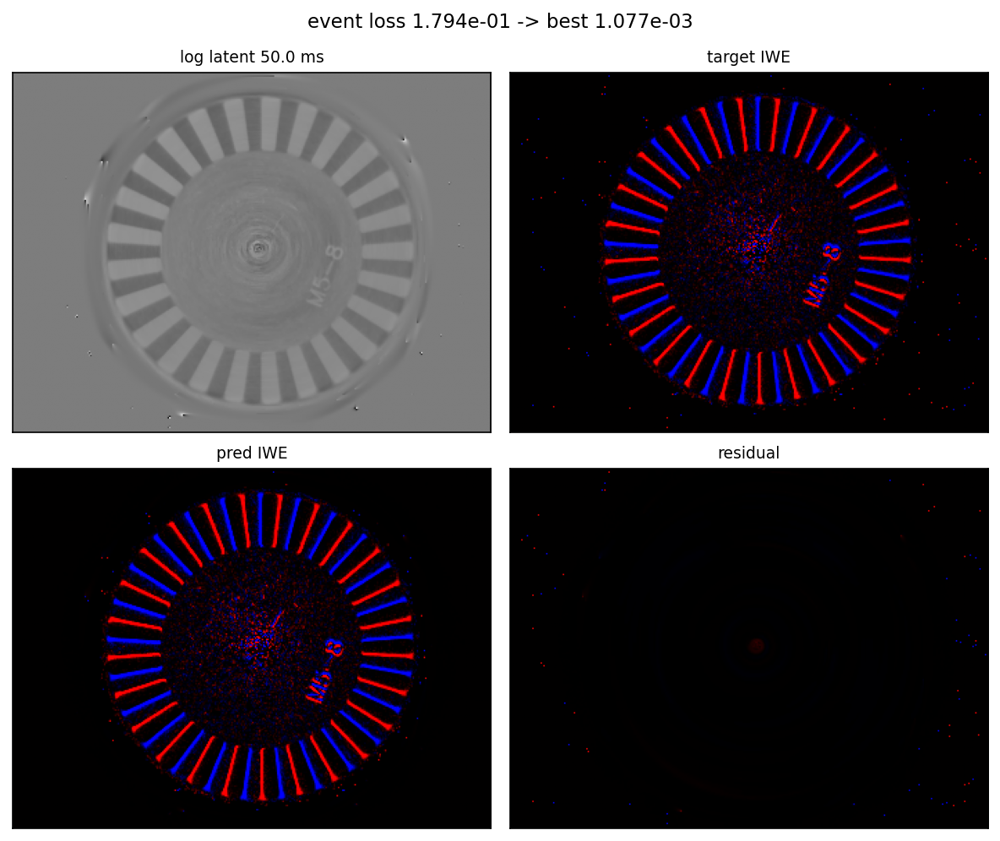

# isl_diff_event

## Rotation Flow Reconstruction Demo

`rotation_demo.py` reconstructs a single log-intensity image from a fixed dense rotation flow and the corresponding IWE constraint. The debug summary below shows the recovered log latent image, target IWE, predicted IWE, and residual.

